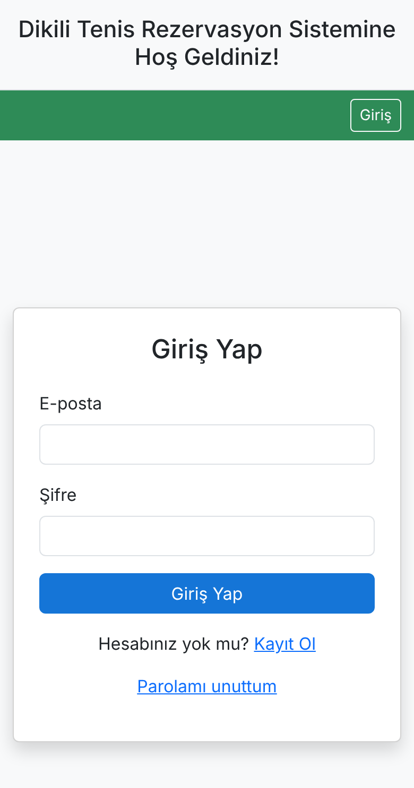
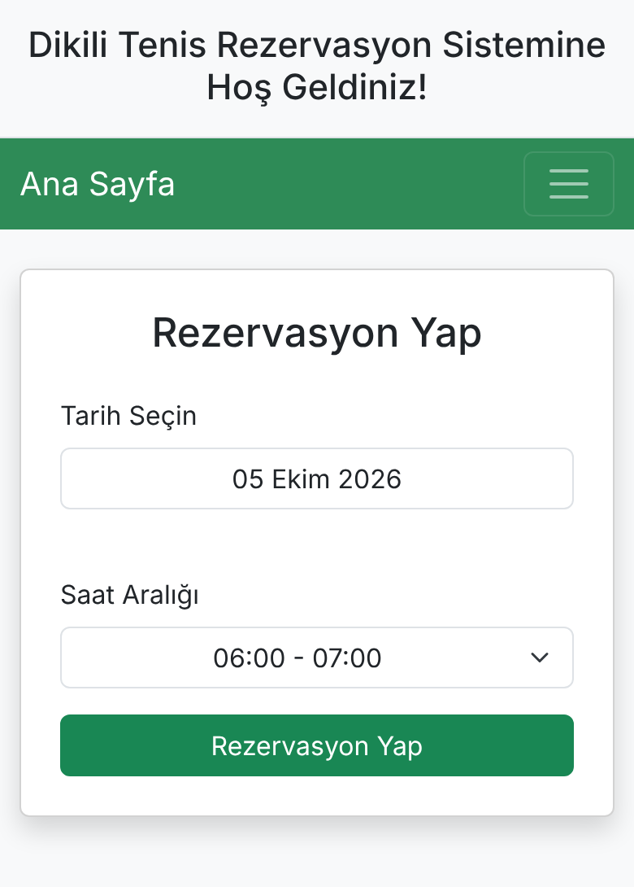
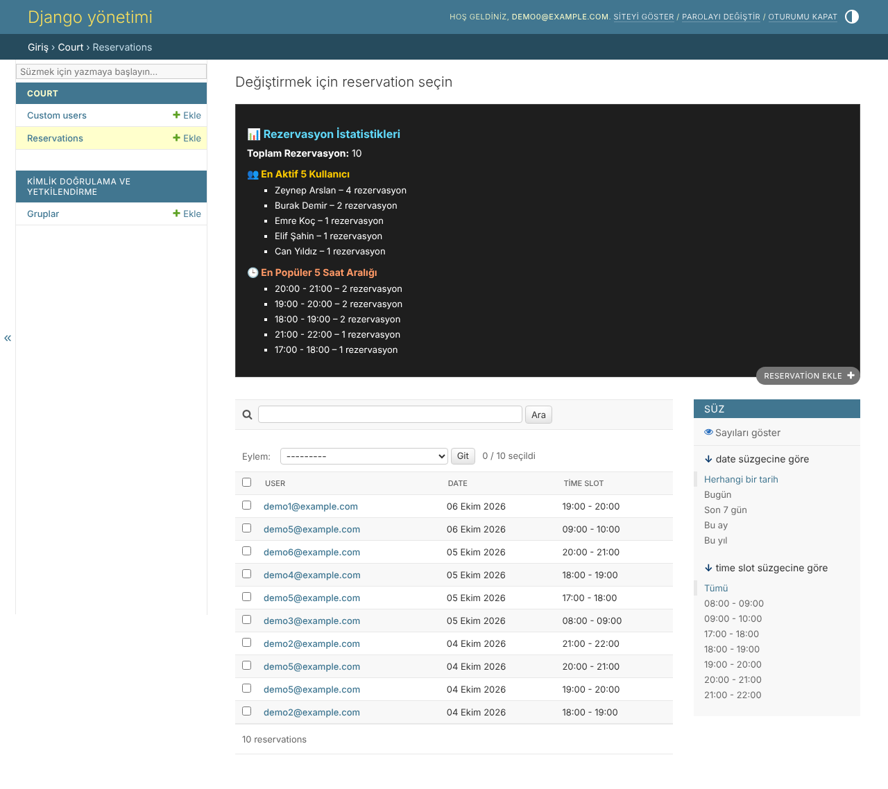

# Dikili Tenis Rezervasyon

Dikili'deki tenis kortu için geliştirilmiş, gerçek kullanıcılara hizmet veren online rezervasyon sistemi.

**Canlı:** https://dikili-tenis-rezervasyon.onrender.com
> Ücretsiz sunucuda çalıştığı için ilk açılış 30-60 saniye sürebilir.

## Ekran görüntüleri

<p>
  
  &nbsp;&nbsp;
  
</p>

**Admin paneli:** rezervasyon listesi, filtreler ve kullanım istatistikleri (en aktif kullanıcılar, en popüler saatler)



*Görüntülerdeki kullanıcılar ve rezervasyonlar demo verisidir.*

## Neden yaptım

Kortta rezervasyonlar bir WhatsApp grubu üzerinden yapılıyordu. Herkes oynayacağı saati gruba yazıyordu, ama yukarıda kalan mesajlar gözden kaçınca aynı saate iki kişi yazabiliyordu. Bu çakışmalar grupta tartışmalara yol açıyordu.

Bu sistemle dolu ve boş saatler tek ekranda görünüyor, aynı saat iki kez alınamıyor ve kişi başı tek aktif rezervasyon kuralıyla kortun adil paylaşımı sağlanıyor.

## Özellikler

- E-posta ile kayıt ve 6 haneli doğrulama kodu
- 06:00-24:00 arası saatlik rezervasyon, en fazla 48 saat ileriye
- Adil kullanım kuralı: kişi başı tek aktif rezervasyon
- Rezervasyon iptali ve şifre sıfırlama akışı
- Son 24 saatin rezervasyonlarını gösteren sayfa
- Admin panelinde kullanım istatistikleri: en aktif 5 kullanıcı, en popüler 5 saat aralığı
- Mobil uyumlu arayüz

## Teknolojiler

- Python, Django 5.2
- Özel kullanıcı modeli (e-posta ile giriş)
- Bootstrap 5, Flatpickr (Türkçe tarih seçici)
- Gunicorn ve WhiteNoise
- Render üzerinde deploy

## Yerelde çalıştırma

```bash
git clone https://github.com/mertyucesoy/dikili-tenis-rezervasyon.git
cd dikili-tenis-rezervasyon
python -m venv venv
source venv/bin/activate   # Windows: venv\Scripts\activate
pip install -r requirements.txt
export DEBUG=True
python manage.py migrate
python manage.py createsuperuser
python manage.py runserver
```

## Ortam değişkenleri

| Değişken | Açıklama |
|---|---|
| `SECRET_KEY` | Django gizli anahtarı (production'da zorunlu) |
| `DEBUG` | Geliştirme için `True` |
| `EMAIL_HOST_PASSWORD` | Doğrulama e-postaları için SMTP şifresi |
